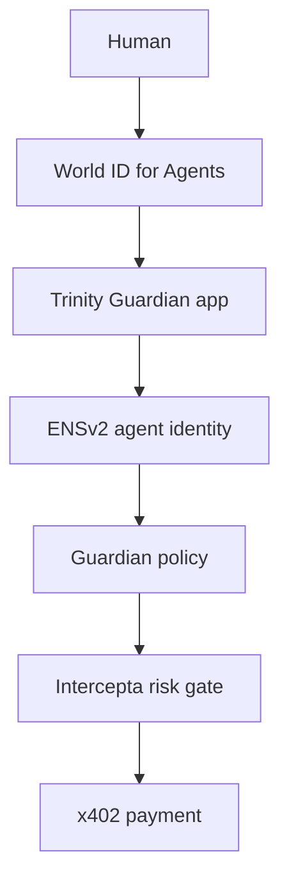
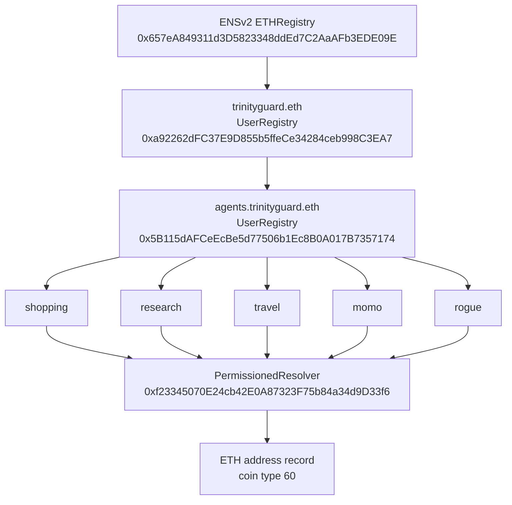
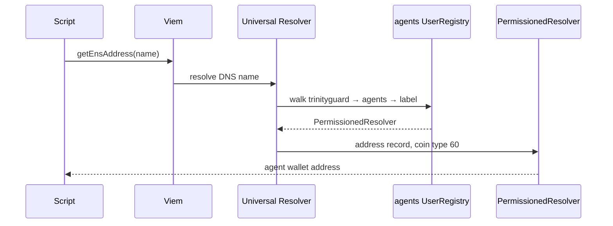

# Trinity Guardian — ENSv2 Module

Trinity Guardian is a security and authorization layer for autonomous AI-agent payments, built for ETHGlobal Tokyo 2026.

The product path is:

**Human → identity → agent → permissions / policy → payment**

This package, `@trinity-guardian/ens`, is the ENSv2 slice of that path. It registers a hierarchical agent namespace on **Ethereum Sepolia** (chain ID `11155111`) and publishes ETH address records that viem can resolve with `getEnsAddress()`.

World ID, spending policy, Intercepta, x402, and SQLite are not implemented in this package.

> **Sepolia testnet / hackathon infrastructure.** Do not treat these contracts, keys, or scripts as production or mainnet configuration.
>
> **Do not commit `.env.local`.** Do not print private keys, RPC URLs, or `ENS_REGISTRATION_SECRET`.

The canonical namespace is `trinityguard.eth`. The name `trinityguardian.eth` appears only in an obsolete script and one usage string. It is not the live namespace.

## What This Package Does

- Talks to Ethereum Sepolia through a viem public client (`createEnsClient`).
- Registers the parent name `trinityguard.eth` with the ENSv2 ETH registrar, paid in the hardcoded Sepolia Mock USDC token.
- Deploys deterministic UserRegistry proxies through the ENSv2 VerifiableFactory.
- Builds this hierarchy and attaches each registry as a subregistry:

  ```text
  trinityguard.eth
  └── agents.trinityguard.eth
      ├── shopping.agents.trinityguard.eth
      ├── research.agents.trinityguard.eth
      └── travel.agents.trinityguard.eth
  ```

- Deploys one PermissionedResolver proxy and points the configured agent names at it.
- Writes an ETH address record (coin type `60`) for each configured agent name.
- Checks that viem resolves all five current demo names to the current demo address.

The library surface is one export:

```ts
createEnsClient(rpcUrl: string)
```

It returns a viem public client bound to `sepolia` from `viem/chains`. An empty RPC URL throws `SEPOLIA_RPC_URL is required`.

## Why ENSv2 Is Used

ENSv2 is used here as hierarchical identity and ENS-native authority.

- `trinityguard.eth` is the project root.
- `agents.trinityguard.eth` is the agent namespace, with its own UserRegistry.
- Each agent is a child label (`shopping`, `research`, `travel`, `momo`, `rogue`) under that registry.
- ENS roles on those registries control registration, subregistry changes, and resolver changes.
- The PermissionedResolver stores the ETH address for a name.
- viem’s Sepolia Universal Resolver reads that record back.

Payment policy is not stored in these ENS records. Leaf agent names are registered with ENS role bitmap `0`. The comment in `scripts/register-agent.ts` states that payment permissions are a separate application layer.

## Architecture

This package implements the ENS agent-identity step. The surrounding boxes are the rest of the Trinity Guardian design. They are not code in this repository.



| Step | Role in the product | In this package |
| --- | --- | --- |
| World ID | Human and agent verification | No |
| ENSv2 | Name, registry hierarchy, ENS roles, address record | Yes |
| Guardian policy | Spend limits, destination allowlists, payment authorization | No |
| Intercepta | Risk screening before payment, when enabled | No |
| x402 | Payment protocol | No |
| SQLite | Application state, including which agents were created | No |

ENS hierarchy deployed by these scripts:



Resolution path exercised by `pnpm ens:check` and by phase 3 of `pnpm ens:setup-resolution`:



`createEnsClient` uses viem’s `sepolia` chain. In the installed viem `2.56.8` definition, `ensUniversalResolver` is `0xeEeEEEeE14D718C2B47D9923Deab1335E144EeEe`. `scripts/debug-universal-resolver.ts` hardcodes the same address.

## ENS Namespace / Hierarchy

```text
trinityguard.eth
└── agents.trinityguard.eth
    ├── shopping.agents.trinityguard.eth
    ├── research.agents.trinityguard.eth
    ├── travel.agents.trinityguard.eth
    ├── momo.agents.trinityguard.eth
    └── rogue.agents.trinityguard.eth
```

| Name | Registry that holds the label | How this package creates it |
| --- | --- | --- |
| `trinityguard.eth` | ENSv2 ETHRegistry | `ens:commit` then `ens:register` |
| `agents.trinityguard.eth` | Trinity Guardian root UserRegistry | `ens:register-agents` |
| `shopping` / `research` / `travel` / `momo` / `rogue` | `agents.trinityguard.eth` UserRegistry | `ens:register-agent <label>` |

`trinityguardian.eth` is obsolete. Do not pass it to `ens:deploy-registry`. The salt is `namehash` of the argument, so the obsolete name would deploy a different registry. `ens:register-shopping` still logs that obsolete name and targets a different registry address. Use `ens:register-agent` instead.

## Current Sepolia Deployment

Network: **Ethereum Sepolia**, chain ID **11155111**.

These addresses are the constants used by the current inspect, register-agent, resolver, and resolution scripts.

| Contract | Address |
| --- | --- |
| ENSv2 ETHRegistry | `0x657eA849311d3D5823348ddEd7C2AaAFb3EDE09E` |
| Trinity Guardian root UserRegistry (`trinityguard.eth`) | `0xa92262dFC37E9D855b5ffeCe34284ceb998C3EA7` |
| `agents.trinityguard.eth` UserRegistry | `0x5B115dAFCeEcBe5d77506b1Ec8B0A017B7357174` |
| PermissionedResolver proxy | `0xf23345070E24cb42E0A87323F75b84a34d9D33f6` |
| PermissionedResolver implementation | `0x14f09fd05d4585759e54844dc9b00147131cf243` |
| UserRegistry implementation | `0xa80338aaa8d23831cea25e858d1774534abb0263` |
| VerifiableFactory | `0x9e726eb570beb6bceb495ab8cda7df517d4e841c` |
| Demo/test wallet on the five address records | `0x9A8F6F3fc819BEE96f0a76bAA4afa424c10c4B11` |

The last row is a **demo/test address**. All five current demo agent names resolve to it. That does not mean production agents should share one wallet. `scripts/setup-agent-resolution.ts` writes `PRIVATE_KEY`’s address into every record and notes that each agent can later have its own wallet.

### Other addresses hardcoded in scripts

These are not the Trinity Guardian registry deployment. They are dependencies the scripts call.

| Use | Address | Where |
| --- | --- | --- |
| ETH registrar | `0xabe76f6c8dfced81aa5a2bb8034202a7136b94ca` | `ens:commit`, `ens:register` |
| Mock USDC payment token | `0x16f95d91dba7da3aca778ec053df0ff6c6a8aa8e` | `ens:register` |
| Universal Resolver | `0xeEeEEEeE14D718C2B47D9923Deab1335E144EeEe` | viem Sepolia chain, and `ens:debug-resolver` |
| Obsolete agents registry | `0xacBFc574821fbE0865387Cb0A884D3ddBc91f166` | `ens:register-shopping` only |

No transaction hashes are stored in this package.

## How Agent Resolution Works

`scripts/check-ens.ts` resolves:

| Name | Resolved address |
| --- | --- |
| `shopping.agents.trinityguard.eth` | `0x9A8F6F3fc819BEE96f0a76bAA4afa424c10c4B11` |
| `research.agents.trinityguard.eth` | `0x9A8F6F3fc819BEE96f0a76bAA4afa424c10c4B11` |
| `travel.agents.trinityguard.eth` | `0x9A8F6F3fc819BEE96f0a76bAA4afa424c10c4B11` |
| `momo.agents.trinityguard.eth` | `0x9A8F6F3fc819BEE96f0a76bAA4afa424c10c4B11` |
| `rogue.agents.trinityguard.eth` | `0x9A8F6F3fc819BEE96f0a76bAA4afa424c10c4B11` |

That check walks the full path:

1. ENSv2 hierarchy: ETHRegistry → `trinityguard.eth` UserRegistry → `agents` → agents UserRegistry → agent label.
2. UserRegistry `getResolver(label)` returns the PermissionedResolver.
3. The resolver holds the ETH address record.
4. viem `getEnsAddress()` queries the Sepolia Universal Resolver.
5. The call returns the agent wallet address.

`ens:check` throws if any name returns null or a different address.

Address records are written by `ens:setup-resolution`:

1. `labelId = uint256(keccak256(bytes(label)))`.
2. `tokenId = UserRegistry.getTokenId(labelId)` on the agents registry.
3. `setResolver(tokenId, permissionedResolver)`.
4. `setAddress(dnsEncodedName, 60, addressBytes)` on the resolver.
5. `getEnsAddress(name)` must equal the signer address.

`setResolver` takes the **current token id** from `getTokenId`, not the raw `keccak256` label id.

## ENS Authority vs Guardian Policy

ENSv2 roles and Trinity Guardian policy are different systems.

**ENSv2** is identity, namespace, and ENS-native authority. The role names below are the bit flags in `scripts/inspect-ens.ts`. They are registry roles.

| Role | Bit |
| --- | --- |
| `REGISTRAR` | `1 << 0` |
| `REGISTRAR_ADMIN` | `REGISTRAR << 128` |
| `REGISTER_RESERVED` | `1 << 4` |
| `SET_PARENT` | `1 << 8` |
| `UNREGISTER` | `1 << 12` |
| `RENEW` | `1 << 16` |
| `SET_SUBREGISTRY` | `1 << 20` |
| `SET_RESOLVER` | `1 << 24` |
| `CAN_TRANSFER_ADMIN` | admin bit only, bit 28 shifted by 128 |
| `SET_URI` | `1 << 36` |
| `CAN_NAME` | `1 << 120` |
| `UPGRADE` | `1 << 124` |

Each non-admin flag also has an admin flag at `flag << 128`, matching the pairs in `inspect-ens.ts`.

New UserRegistry proxies are initialized with:

`REGISTRAR`, `REGISTRAR_ADMIN`, `SET_SUBREGISTRY`, `SET_SUBREGISTRY_ADMIN`, `SET_RESOLVER`, `SET_RESOLVER_ADMIN`.

`ens:register-agents` grants that same bitmap to the `agents` label. `ens:register-agent` grants **zero** ENS roles to the agent label. The agent name can be resolved. It is not given registrar, subregistry, or resolver admin on the ENS registry.

**Trinity Guardian policy** is the business and payment layer outside this package:

- whether an agent may pay
- spending limits
- destination allowlists
- World ID requirements
- Intercepta risk decisions
- x402 payment authorization

`PAYMENT_ROLE`, `SPENDING_LIMIT_ROLE`, and `DESTINATION_ALLOWLIST_ROLE` are not roles in this codebase. ENS is not the storage layer for spending limits or destination allowlists.

| Layer | What it decides |
| --- | --- |
| ENSv2 | Identity, namespace, ENS-native authority |
| Trinity Guardian | Business and payment policy |
| World ID | Human and agent verification |
| Intercepta | Payment risk gate |
| x402 | Payment protocol |

The PermissionedResolver initializer grants the deployer one role bitmap recovered from the deployed Sepolia generation:

`0x1000000000000000000000000100011110000000000000000000000001000111`

This package does not name those resolver bits. Do not treat that bitmap as the UserRegistry role table.

## Project Structure

```text
packages/guardian-ens/
├── .env.example
├── .gitignore              # ignores .env and .env.local
├── package.json
├── tsconfig.json
├── src/
│   ├── client.ts           # createEnsClient → viem sepolia public client
│   └── index.ts            # re-exports createEnsClient
├── scripts/                # Sepolia operational scripts
└── test/                   # empty; no vitest config
```

| Script | pnpm command |
| --- | --- |
| `scripts/check-rpc.ts` | `pnpm rpc:check` |
| `scripts/check-wallet.ts` | `pnpm wallet:check` |
| `scripts/check-ens.ts` | `pnpm ens:check` |
| `scripts/inspect-ens.ts` | `pnpm ens:inspect` |
| `scripts/commit-name.ts` | `pnpm ens:commit` |
| `scripts/register-name.ts` | `pnpm ens:register` |
| `scripts/deploy-user-registry.ts` | `pnpm ens:deploy-registry` |
| `scripts/attach-subregistry.ts` | `pnpm ens:attach-subregistry` |
| `scripts/register-agents.ts` | `pnpm ens:register-agents` |
| `scripts/attach-agents-subregistry.ts` | `pnpm ens:attach-agents` |
| `scripts/register-agent.ts` | `pnpm ens:register-agent` |
| `scripts/register-shopping.ts` | `pnpm ens:register-shopping` (obsolete) |
| `scripts/deploy-permissioned-resolver.ts` | `pnpm ens:deploy-resolver` |
| `scripts/setup-agent-resolution.ts` | `pnpm ens:setup-resolution` |
| `scripts/debug-universal-resolver.ts` | `pnpm ens:debug-resolver` |
| `scripts/scan-factory.ts` | `pnpm ens:scan-factory` |
| `scripts/check-resolver-impl.ts` | none |

`check-resolver-impl.ts` reads bytecode at the PermissionedResolver implementation and calls `verifyContract` on that implementation address. The deploy script says `verifyContract` is a factory call on a **proxy**, so this diagnostic is expected to revert or report the implementation as unverified. It is not a setup step.

## Requirements

- Node.js 22.6 or newer, so `node --experimental-strip-types` is available. Every ENS script is started with that flag.
- pnpm `^11.9.0` (`package.json` `devEngines`).
- A Sepolia RPC endpoint.
- A Sepolia wallet with ETH for gas, for any write script.
- Mock USDC balance and allowance, only for `ens:register`. The script approves the registrar if the allowance is short.

Run these commands from `packages/guardian-ens`. The wider Trinity Guardian repository also contains the agent, guardian, seller, and UI packages; this README documents only the ENSv2 package.

## Environment Variables

Copy the example file and edit the copy:

```bash
cp .env.example .env.local
```

`.env.local` is gitignored. Do not commit it.

Scripts load it with `node --env-file=.env.local`. **Already-exported shell variables win.** `--env-file` does not override them. A stale exported `ENS_REGISTRATION_SECRET` will be used by `ens:register` even after `ens:commit` rewrites `.env.local`.

If that happens, clear the shell variable without printing it:

```bash
unset ENS_REGISTRATION_SECRET
```

Do not `source .env.local`. Sourcing exports every value into the shell, including the key and the registration secret, and those exports keep overriding the file.

| Variable in `.env.example` | Sensitivity | What the code does with it |
| --- | --- | --- |
| `SEPOLIA_RPC_URL` | RPC credential | Required by every script. Never print it. |
| `PRIVATE_KEY` | Wallet private key | Required by write scripts and `wallet:check`. Never print it. |
| `ENS_REGISTRATION_SECRET` | ENS registration secret | Written by `ens:commit`. Read by `ens:register`. Never print it. |
| `MOCK_USDC` | Public if set | **Not read.** `ens:register` hardcodes the token address. |
| `WALLET` | Public if set | **Not read.** |
| `ETH_REGISTRAR` | Public if set | **Not read.** Commit and register hardcode the registrar. |
| `LABEL` | Public if set | **Not read.** Labels are CLI arguments. |
| `DURATION` | Public if set | **Not read.** Commit and register use `31536000` seconds (365 days). |
| `PRICE` | Public if set | **Not read.** `ens:register` calls `getRegisterPrice`. |

`DRY_RUN` is not in `.env.example`. Scripts that support it check `process.env.DRY_RUN === "true"`.

```bash
DRY_RUN=true pnpm ens:deploy-resolver
```

`PRIVATE_KEY` must be `0x`-prefixed for `wallet:check`, `ens:commit`, `ens:register`, and `ens:deploy-registry`. Later scripts add the prefix if it is missing. Use a prefixed key everywhere.

## Installation

```bash
cd packages/guardian-ens
pnpm install
cp .env.example .env.local
```

Fill `SEPOLIA_RPC_URL` and `PRIVATE_KEY` in `.env.local`. Leave `ENS_REGISTRATION_SECRET` empty until `ens:commit` writes it.

## Available Commands

`package.json` scripts:

| Command | Mode |
| --- | --- |
| `pnpm typecheck` | Local only |
| `pnpm test` | Local only |
| `pnpm test:watch` | Local only |
| `pnpm rpc:check` | READ ONLY |
| `pnpm wallet:check` | READ ONLY |
| `pnpm ens:check` | READ ONLY |
| `pnpm ens:inspect` | READ ONLY |
| `pnpm ens:debug-resolver` | READ ONLY |
| `pnpm ens:scan-factory` | READ ONLY |
| `pnpm ens:commit` | ON-CHAIN WRITE |
| `pnpm ens:register` | ON-CHAIN WRITE |
| `pnpm ens:deploy-registry` | ON-CHAIN WRITE |
| `pnpm ens:attach-subregistry` | ON-CHAIN WRITE |
| `pnpm ens:register-agents` | ON-CHAIN WRITE |
| `pnpm ens:attach-agents` | ON-CHAIN WRITE |
| `pnpm ens:register-agent` | ON-CHAIN WRITE |
| `pnpm ens:register-shopping` | ON-CHAIN WRITE |
| `pnpm ens:deploy-resolver` | ON-CHAIN WRITE |
| `pnpm ens:setup-resolution` | ON-CHAIN WRITE |

### Local

#### `pnpm typecheck`

`tsc --noEmit`. Compiles `src/**/*.ts`, `scripts/**/*.ts`, and `test/**/*.ts`. No RPC and no wallet. Safe to rerun.

#### `pnpm test` and `pnpm test:watch`

`vitest run` and `vitest`. `test/` is empty and there is no Vitest config. These commands do not check ENS resolution. Use `pnpm ens:check` for that.

### Read only

#### `pnpm rpc:check`

Reads `SEPOLIA_RPC_URL`, prints chain ID and latest block, and throws unless the chain ID is `11155111`. No arguments. Safe to rerun.

#### `pnpm wallet:check`

Reads `SEPOLIA_RPC_URL` and `PRIVATE_KEY`. Prints the address derived from the key and its Sepolia ETH balance. Warns when the balance is zero. Does not print the key. No arguments. Safe to rerun.

#### `pnpm ens:check`

Resolves the five current demo agent names with `getEnsAddress`. Succeeds only when each one equals `0x9A8F6F3fc819BEE96f0a76bAA4afa424c10c4B11`. No arguments. Safe to rerun. This is the smoke test for the current deployment.

#### `pnpm ens:inspect`

Reads `trinityguard.eth` on the ETHRegistry and `agents.trinityguard.eth` on the root UserRegistry. For each name it prints owner, expiry, token id from `getTokenId`, resolver, subregistry, and ENS roles.

```bash
pnpm ens:inspect
pnpm ens:inspect 0xYourAccount
```

The optional argument is the account whose roles are displayed. The default is the demo address above. Read only. Safe to rerun. It does not enumerate `shopping`, `research`, or `travel`.

#### `pnpm ens:debug-resolver`

Calls `getEnsAddress` and Universal Resolver `resolve(bytes,bytes)` for **`ur.integration-tests.eth`**. That name is an external fixture. It does not verify Trinity Guardian agents. Use `pnpm ens:check` for this project. Read only. Safe to rerun. No arguments.

#### `pnpm ens:scan-factory`

Walks `ProxyDeployed` logs on the VerifiableFactory from the latest block back to genesis, in chunks of 50,000 blocks, then calls `verifyContract` for each proxy. Read only, and expensive on the RPC. No arguments. Safe to rerun. Not required to verify the known Trinity Guardian proxies.

### On-chain writes

`DRY_RUN=true` simulates and exits before broadcast for the commands marked below. `ens:commit`, `ens:register`, and `ens:register-shopping` have **no** dry run.

#### `pnpm ens:commit <label>`

⚠️ **ON-CHAIN WRITE.** No dry run.

```bash
pnpm ens:commit trinityguard
```

Calls ETH registrar `makeCommitment` and `commit` for `<label>.eth`. Duration is 365 days. Subregistry, resolver, and referrer are zero. Generates a new 32-byte secret, writes `ENS_REGISTRATION_SECRET` into `.env.local`, and does not print the secret. Requires `SEPOLIA_RPC_URL` and `PRIVATE_KEY`. `.env.local` must already exist or the write fails.

Not safe to rerun casually. A second run submits a new commitment and **replaces** the secret in `.env.local`. The previous secret is then gone from the file.

#### `pnpm ens:register <label>`

⚠️ **ON-CHAIN WRITE.** No dry run.

```bash
pnpm ens:register trinityguard
```

Requires `ENS_REGISTRATION_SECRET` from the matching commit. Checks `isAvailable`, reads `getRegisterPrice` in Mock USDC, approves the registrar if needed, then `register`. Throws if the label is no longer available.

The script does not wait for the registrar’s commitment window. Register after the minimum commitment age and before the commitment expires. If the shell still has an old `ENS_REGISTRATION_SECRET`, this call uses that value, not the file. `unset ENS_REGISTRATION_SECRET` first, then run the command so `--env-file` can load the file.

Not idempotent. A second successful registration cannot re-register an unavailable name.

#### `pnpm ens:deploy-registry <namespace>`

⚠️ **ON-CHAIN WRITE.** Supports `DRY_RUN=true`.

```bash
DRY_RUN=true pnpm ens:deploy-registry trinityguard.eth
DRY_RUN=true pnpm ens:deploy-registry agents.trinityguard.eth
```

Deploys a UserRegistry proxy via `VerifiableFactory.deployProxy`. Salt is the ENSv2 scheme: `keccak256(abi.encode(keccak256("UserRegistry"), namehash(namespace), 0))`. The initializer is `initialize((address,uint256)[])` and grants the signer the registry admin bitmap described above.

The usage error in the script still shows `agents.trinityguardian.eth`. Pass a `trinityguard.eth` namespace.

The script does not check for an existing proxy before simulating. If that CREATE2 address already has code, simulation reverts. Verify the current proxies before running this. A second deploy of the same namespace and version is not a no-op.

#### `pnpm ens:attach-subregistry <label> <user-registry>`

⚠️ **ON-CHAIN WRITE.** Supports `DRY_RUN=true`.

```bash
DRY_RUN=true pnpm ens:attach-subregistry trinityguard 0xa92262dFC37E9D855b5ffeCe34284ceb998C3EA7
```

Calls `setSubregistry` on the **ETHRegistry** for `<label>.eth`. The id argument is `uint256(keccak256(bytes(label)))`, the raw label id. After the transaction it reads `getSubregistry(label)` and requires a match.

For the current root, this attachment already exists. Rerunning `setSubregistry` is another write.

#### `pnpm ens:register-agents <parent-label> <user-registry>`

⚠️ **ON-CHAIN WRITE.** Supports `DRY_RUN=true`.

```bash
DRY_RUN=true pnpm ens:register-agents trinityguard 0xa92262dFC37E9D855b5ffeCe34284ceb998C3EA7
```

Registers the fixed label `agents` on `<user-registry>`, producing `agents.<parent-label>.eth`. Owner is the signer. Child registry and resolver are zero at registration time. Role bitmap matches the UserRegistry admin bitmap. Expiry is copied from `<parent-label>.eth` on the ETHRegistry (`getExpiry` of the raw label id). Throws if that expiry is zero.

Not for arbitrary agent labels. Use `ens:register-agent` for those. Not safe to rerun once `agents` exists; registration of an existing label reverts in simulation.

#### `pnpm ens:attach-agents <parent-registry> <label> <child-registry>`

⚠️ **ON-CHAIN WRITE.** Supports `DRY_RUN=true`.

```bash
DRY_RUN=true pnpm ens:attach-agents \
  0xa92262dFC37E9D855b5ffeCe34284ceb998C3EA7 \
  agents \
  0x5B115dAFCeEcBe5d77506b1Ec8B0A017B7357174
```

`setSubregistry(rawLabelId, childRegistry)` on the parent UserRegistry, then checks `getSubregistry(label)`. Same raw label id as `ens:attach-subregistry`. The live `agents` subregistry is already attached. Rerunning is another write.

#### `pnpm ens:register-agent <agent-label>`

⚠️ **ON-CHAIN WRITE.** Supports `DRY_RUN=true`.

```bash
DRY_RUN=true pnpm ens:register-agent shopping
```

Registers `<label>.agents.trinityguard.eth` on the agents UserRegistry `0x5B115dAFCeEcBe5d77506b1Ec8B0A017B7357174`. The label must match `^[a-z0-9-]+$`. Owner is the signer. Registry and resolver arguments are the zero address. ENS role bitmap is `0`. Expiry is the parent expiry of `agents` on the root UserRegistry.

Dry run simulates and prints the expected token id, then exits. A real run verifies `findOwner`. It does **not** set a resolver or an address. `ens:setup-resolution` only does that for `shopping`, `research`, and `travel`.

Rerunning an existing label fails simulation. Safe only when the label is new.

#### `pnpm ens:register-shopping`

⚠️ **ON-CHAIN WRITE.** No dry run. **Do not use this for the current namespace.**

The script hardcodes registry `0xacBFc574821fbE0865387Cb0A884D3ddBc91f166`, expiry `1821898044`, and logs `shopping.agents.trinityguardian.eth`. It does not register `shopping.agents.trinityguard.eth` and it does not accept arguments. It always broadcasts.

#### `pnpm ens:deploy-resolver`

⚠️ **ON-CHAIN WRITE.** Supports `DRY_RUN=true`.

Deploys the PermissionedResolver through the same factory. Implementation `0x14f09fd05d4585759e54844dc9b00147131cf243`. Salt:

```text
keccak256("TrinityGuardianPermissionedResolver:<signer-lowercase>:<version>")
```

`RESOLVER_VERSION` is `0`. The initializer is `initialize((address,uint256)[], bytes[])`. The script throws unless the selector is `0x33cc44a0`. `setters` is an empty array. One grant is the signer plus the recovered role bitmap.

For version 0 the script first checks `0xf23345070E24cb42E0A87323F75b84a34d9D33f6`. If that address has code, it calls `factory.verifyContract(proxy)` and exits 0 when the implementation matches. **Rerunning against the current deployment does not send a transaction.**

`verifyContract` is called on the factory, with the proxy as the argument. It is not called on the resolver.

No CLI arguments. Changing the salt formula or `RESOLVER_VERSION` targets a different proxy. Leave version `0` alone for the deployed resolver.

#### `pnpm ens:setup-resolution [agent-label ...]`

⚠️ **ON-CHAIN WRITE.** Supports `DRY_RUN=true` for phase 1 only.

Without arguments, the default agents are `shopping`, `research`, and `travel`. When labels are supplied, only those labels are processed. The agents registry and PermissionedResolver are the current deployed constants.

```bash
# Default agents
pnpm ens:setup-resolution

# Selected agents
pnpm ens:setup-resolution momo rogue
```

Phase 1, for each label:

- read `getTokenId(rawLabelId)`
- read `getResolver(label)`
- if the resolver is already the PermissionedResolver, skip
- otherwise simulate `setResolver(tokenId, resolver)`
- broadcast unless `DRY_RUN=true`

`DRY_RUN=true` stops after phase 1. It does not simulate `setAddress`, because that write depends on the registry already pointing at the resolver.

Phase 2 calls `setAddress` for every selected name, every time. It does not read the existing record first. The value is the signer address as 20 raw bytes, coin type `60`, name DNS-encoded (`shopping.agents.trinityguard.eth` → length-prefixed labels ending in `0x00`).

Phase 3 calls `getEnsAddress` and requires the resolved address to equal the signer.

Rerun behavior:

- Phase 1 is safe when the resolver is already set. It skips those names.
- Phase 2 sends new transactions on every full run and spends gas.
- A different `PRIVATE_KEY` overwrites the address records. `pnpm ens:check` would then fail, because it expects the demo address.

## Initial Deployment / Setup Flow

The hierarchy in [Current Sepolia Deployment](#current-sepolia-deployment) is already on Sepolia. Verify it with the next section. Run this flow only to reproduce from an empty namespace, and run `DRY_RUN=true` on every command that supports it before the real broadcast.

1. `pnpm install`, then create `.env.local` from `.env.example`.
2. `pnpm rpc:check` and `pnpm wallet:check`.
3. `pnpm ens:commit trinityguard`.
4. Wait for the registrar commitment window. The script does not wait. `unset ENS_REGISTRATION_SECRET` if it was exported.
5. `pnpm ens:register trinityguard`.
6. `DRY_RUN=true pnpm ens:deploy-registry trinityguard.eth`, then the same command without `DRY_RUN`. Save the printed proxy.
7. `DRY_RUN=true pnpm ens:attach-subregistry trinityguard <root-proxy>`.
8. `DRY_RUN=true pnpm ens:register-agents trinityguard <root-proxy>`.
9. `DRY_RUN=true pnpm ens:deploy-registry agents.trinityguard.eth`.
10. `DRY_RUN=true pnpm ens:attach-agents <root-proxy> agents <agents-proxy>`.
11. `DRY_RUN=true pnpm ens:register-agent shopping`, then `research`, `travel`, `momo`, and `rogue` (broadcast each after its dry run).
12. `DRY_RUN=true pnpm ens:deploy-resolver`, then without `DRY_RUN` if no proxy exists yet.
13. `DRY_RUN=true pnpm ens:setup-resolution`, then without `DRY_RUN` for the default three; run `DRY_RUN=true pnpm ens:setup-resolution momo rogue` and then the write command for the two plan/demo agents.
14. `pnpm ens:check`.

Skip `ens:register-shopping`.

## Verify Existing Deployment

READ ONLY. Start here.

```bash
cd packages/guardian-ens
pnpm rpc:check
pnpm ens:inspect
pnpm ens:check
```

`ens:inspect` shows the root and `agents` registry links. `ens:check` is the end-to-end resolution test. Do not redeploy registries or the version-0 resolver when these succeed.

`ens:deploy-resolver` on the current version-0 proxy is the one write command that detects the existing proxy and exits without a transaction. The registry deploy and attach scripts do not do that.

## Adding a New Agent

⚠️ **ON-CHAIN WRITE** for the register step.

```bash
DRY_RUN=true pnpm ens:register-agent <label>
pnpm ens:register-agent <label>
```

`<label>` is a single DNS label: lowercase letters, digits, and hyphens. The script registers `<label>.agents.trinityguard.eth` with ENS role bitmap `0` and the parent `agents` expiry.

What this does **not** do:

- It does not set a resolver.
- It does not write an address record.
- `ens:check` only checks the five current demo names unless its list is extended.

After registration, publish resolution for the new label with the same setup command:

```bash
DRY_RUN=true pnpm ens:setup-resolution <label>
pnpm ens:setup-resolution <label>
```

The setup command performs `getTokenId` → `setResolver(tokenId, …)` → `setAddress` for the supplied label. Until those steps complete, `getEnsAddress` for the new name will not return its wallet.

There is no ENS call in this package that lists every child label. Track created agents in application state (SQLite in the wider system) and verify each name on chain.

## End-to-End Resolution Test

```bash
pnpm ens:check
```

READ ONLY. Requires `SEPOLIA_RPC_URL` only.

This is the test that the five current demo names still resolve through viem.

## Expected Results

`pnpm rpc:check`:

```text
Network: Ethereum Sepolia
Chain ID: 11155111
Latest block: <current block>
Sepolia RPC connection OK
```

`pnpm ens:check` on the current deployment:

```text
Trinity Guardian — ENSv2 Resolution Check
─────────────────────────────────────────
Network: Ethereum Sepolia
Expected address: 0x9A8F6F3fc819BEE96f0a76bAA4afa424c10c4B11

Resolving: shopping.agents.trinityguard.eth
  Resolved: 0x9A8F6F3fc819BEE96f0a76bAA4afa424c10c4B11
  Resolution OK ✓

Resolving: research.agents.trinityguard.eth
  Resolved: 0x9A8F6F3fc819BEE96f0a76bAA4afa424c10c4B11
  Resolution OK ✓

Resolving: travel.agents.trinityguard.eth
  Resolved: 0x9A8F6F3fc819BEE96f0a76bAA4afa424c10c4B11
  Resolution OK ✓

Resolving: momo.agents.trinityguard.eth
  Resolved: 0x9A8F6F3fc819BEE96f0a76bAA4afa424c10c4B11
  Resolution OK ✓

Resolving: rogue.agents.trinityguard.eth
  Resolved: 0x9A8F6F3fc819BEE96f0a76bAA4afa424c10c4B11
  Resolution OK ✓

All Trinity Guardian ENSv2 agent names resolved successfully.
```

`pnpm wallet:check` prints the address of `PRIVATE_KEY` and a Sepolia ETH balance. It does not print the key. The address records above match the demo wallet because setup wrote the signer address that was used for those transactions.

This repository does not store historical transaction hashes.

## Important Implementation Details

The deployed ENSv2 beta contracts are what these scripts call. They are not assumed to match current ENSv2 repository HEAD or an older tagged source. ABIs below are the ones encoded in this package.

### Label id vs token id

```text
rawLabelId = uint256(keccak256(bytes(label)))
tokenId    = UserRegistry.getTokenId(rawLabelId)
```

`setResolver(uint256 tokenId, address resolver)` must receive `tokenId`.

Passing `rawLabelId` to `setResolver` is the wrong id on this deployment and reverts.

`getResolver` is a different signature:

```text
getResolver(string label) → address
```

`ens:attach-subregistry` and `ens:attach-agents` call `setSubregistry(uint256,address)` with the **raw** label id, not `getTokenId`. That is what those scripts do today. Do not copy that pattern into `setResolver`.

### PermissionedResolver

Initializer used by `ens:deploy-resolver`:

```text
initialize((address account, uint256 roles)[], bytes[] setters)
selector 0x33cc44a0
```

Address setter used by `ens:setup-resolution`:

```text
setAddress(bytes name, uint256 coinType, bytes value)
```

- `name` is DNS-encoded, not a human string and not a namehash.
- `coinType` is `60` (Ethereum).
- `value` is the address as 20 raw bytes, lowercase hex, not an ABI-encoded `address`.

The script checks the initializer selector before deploy and aborts on any other selector.

### Deterministic proxies

UserRegistry salt includes `namehash(namespace)` and version `0`. The same namespace and signer roles always aim at the same proxy. An existing proxy makes `deployProxy` revert. Inspect and reuse it.

Resolver version 0 is pinned to `0xf23345070E24cb42E0A87323F75b84a34d9D33f6` in the deploy script. The salt also includes the signer address. A different `PRIVATE_KEY` produces a different predicted proxy. The known-address short circuit still checks the deployed proxy first when `RESOLVER_VERSION` is `0`.

### Registration commitment

`ens:commit` stores the secret only in `.env.local`. `ens:register` sends that secret to `register(...)`. The commitment was built from the same secret, owner, duration, and zero subregistry/resolver/referrer. Any mismatch between the secret used at commit and the secret used at register makes `register` fail.

## Safety / Security Notes

1. Never commit `.env.local`. `.gitignore` ignores `.env`, `.env.local`, and `.env*.local`.
2. Never expose `PRIVATE_KEY`.
3. Never expose private RPC URLs or API keys inside `SEPOLIA_RPC_URL`.
4. Never print `ENS_REGISTRATION_SECRET`. `ens:commit` writes it to `.env.local` and does not log it. Keep it that way.
5. Do not rerun deployment scripts blindly. `ens:commit` rotates the secret. `ens:register`, `ens:register-agents`, and `ens:register-agent` revert when the name exists. `ens:deploy-registry` reverts when the proxy exists. `ens:setup-resolution` rewrites address records on every full run.
6. UserRegistry and PermissionedResolver proxies are deterministic CREATE2 deployments. The salt is part of the address.
7. Verify with `pnpm ens:inspect` and `pnpm ens:check` before any redeploy.
8. Run `DRY_RUN=true` first on every write command that supports it.
9. `node --env-file=.env.local` does not override variables already exported in the shell.
10. A stale exported `ENS_REGISTRATION_SECRET` has caused commitment mismatches against the secret just written to `.env.local`.
11. Do not `source .env.local`.
12. To drop a stale shell secret without displaying it: `unset ENS_REGISTRATION_SECRET`.
13. This package targets Ethereum Sepolia only. It is hackathon/testnet infrastructure, not production wallet infrastructure.
14. The five current demo names share `0x9A8F6F3fc819BEE96f0a76bAA4afa424c10c4B11` on purpose for the current test. Do not copy that pattern into a production agent design.

## Known Limitations / Hackathon MVP Decisions

- Ethereum Sepolia only. `createEnsClient` hardcodes viem’s `sepolia` chain, chain ID `11155111`.
- `shopping`, `research`, `travel`, `momo`, and `rogue` all resolve to the same demo/test wallet.
- SQLite and application policy live outside this package. This repository currently contains this ENS package and a one-line root README.
- Spending limits and destination allowlists are not ENS records here. The resolver write is `setAddress` only.
- Intercepta and x402 are outside this package.
- Hackathon/testnet infrastructure, not production wallet infrastructure.
- Nothing in this package lists all agent names in one ENS view call. `ens:inspect` reads two fixed names. The application can store created agents in SQLite and verify each one on chain.
- ENSv2 beta behavior used here (`getTokenId`, `getResolver(string)`, initializer `0x33cc44a0`, `setAddress(bytes,uint256,bytes)`) was checked against this deployment. Do not replace these ABIs with unexamined upstream source.
- `ens:register-shopping` and the usage example in `ens:deploy-registry` still mention the obsolete `trinityguardian.eth` name.
- `.env.example` lists `MOCK_USDC`, `WALLET`, `ETH_REGISTRAR`, `LABEL`, `DURATION`, and `PRICE`, and no script reads them.
- `test/` has no tests.
- `ens:commit` and `ens:register` cannot dry-run. `ens:setup-resolution` dry-run does not simulate `setAddress`.

## Troubleshooting

### Resolver returns an unexpected address

Use this package’s names and checker:

```bash
pnpm ens:check
```

`pnpm ens:debug-resolver` resolves `ur.integration-tests.eth`. A result for that fixture says nothing about the five current `*.agents.trinityguard.eth` demo names.

`ens:check` fails when the resolved address is not the demo wallet. A later `ens:setup-resolution` run with a different `PRIVATE_KEY` overwrites the selected records and causes that failure.

### `setResolver` reverts

`setResolver` on this UserRegistry takes the current token id:

```text
rawLabelId = uint256(keccak256(bytes(label)))
tokenId    = getTokenId(rawLabelId)
setResolver(tokenId, resolver)
```

Do not pass `rawLabelId` to `setResolver`. `ens:setup-resolution` already performs this lookup on `0x5B115dAFCeEcBe5d77506b1Ec8B0A017B7357174`.

### `getResolver` ABI

This deployment’s read method, as used by inspect, register-agent, and setup, is:

```text
getResolver(string label) → address
```

It is not `getResolver(uint256)`.

### Registration commitment mismatch / `CommitmentTooOld`

`ens:register` sends `process.env.ENS_REGISTRATION_SECRET`. With `node --env-file=.env.local`, a secret already exported in the shell replaces the value `ens:commit` saved.

```bash
unset ENS_REGISTRATION_SECRET
pnpm ens:register trinityguard
```

Do not echo the variable.

`ens:commit` and `ens:register` are separate transactions. This package does not encode the registrar’s minimum or maximum commitment age. Register inside the registrar’s window. A commitment that has aged out fails on chain. Rerunning `ens:commit` starts a new commitment and replaces the secret in `.env.local`; the new secret does not revive the previous commitment.

### Deterministic proxy already exists

`ens:deploy-registry` simulates `deployProxy` and reverts when that salt is already deployed. Read the existing proxy with `pnpm ens:inspect` and keep using the addresses in [Current Sepolia Deployment](#current-sepolia-deployment).

`ens:deploy-resolver` for version 0 is different: if `0xf23345070E24cb42E0A87323F75b84a34d9D33f6` has code and `factory.verifyContract` returns implementation `0x14f09fd05d4585759e54844dc9b00147131cf243`, the script exits without a new deploy.

### PermissionedResolver ABI mismatch

The initializer and `setAddress` signatures in `scripts/deploy-permissioned-resolver.ts` and `scripts/setup-agent-resolution.ts` are the beta generation verified for this Sepolia deployment, including selector `0x33cc44a0`. If a call is encoded from a different ENSv2 tag, the selector check in the deploy script fails closed, or the on-chain call reverts. Use the signatures in those two scripts for this deployment.

## Integration With the Main Trinity Guardian App

This README covers `packages/guardian-ens`. The wider repository also contains agent, guardian, seller, and UI packages. This ENS package itself does not import World ID, Intercepta, x402, or SQLite.

The app should treat ENS as identity:

1. Create or look up the agent name (`<label>.agents.trinityguard.eth`).
2. Resolve it on Ethereum Sepolia with viem `getEnsAddress`, or with `createEnsClient(rpcUrl)` from `@trinity-guardian/ens`.
3. Keep spend limits, allowlists, World ID requirements, and payment decisions in the application database and policy layer.
4. When Intercepta is enabled, run that risk check before x402 payment. Those steps are outside this package.

`createEnsClient` is a public client only. It does not sign, and it does not know about agent policy.

A shared demo wallet is what the five current demo records resolve to. An application that creates more agents should give each agent its own address record and should not infer payment rights from the ENS name alone. Leaf names are registered with ENS role bitmap `0`.

## Future Work

Not implemented in this package:

- A distinct ETH address per agent. The setup script already comments that the shared test wallet is temporary.
- Removing or replacing `ens:register-shopping` and the obsolete `trinityguardian.eth` example on `ens:deploy-registry`.
- Reading `.env.example` values that the scripts currently ignore, or deleting those unused keys.
- Tests. `pnpm test` has no test files.
- On-chain indexing of every child label. The intended application approach is to record created agents off chain and verify them with `getEnsAddress`.
- Wiring this resolver into World ID, Guardian policy, Intercepta, and x402. Those stay outside the ENS registry.

This module was developed as part of Trinity Guardian for ETHGlobal Tokyo 2026. The deployment above is a Sepolia hackathon deployment verified by `getEnsAddress` on the five current demo names.
